# La grande dégustation du 27 janvier 2019

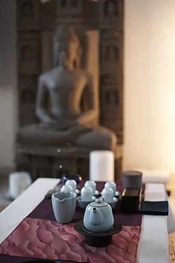

Le dimanche 27 janvier 2019, nous avons organisé notre 2ème édition de Grande Dégustation. Le thème : les 10 grands thés de Taiwan, comme l'an dernier.

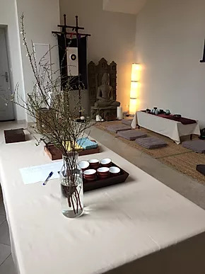

Le lieu est soigneusement préparé avec le respect et l'attention de mes élèves.

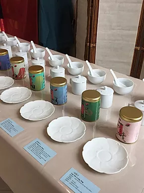

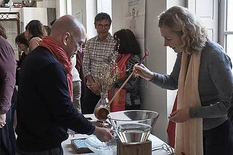

L'événement débute à 15 heures. Nous offrons aux arrivants de l'eau claire et de l'eau chaude pour la première étape : purifier les mains, se débarrasser des émotions parasites.

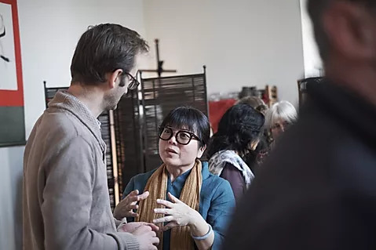

C'est toujours un grand plaisir de revoir les personnes avec qui le lien s'est tissé grâce au thé.

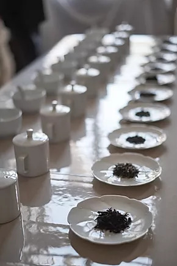

Les thés sont prêts et impatients d'être infusés pour l'ultime rencontre.

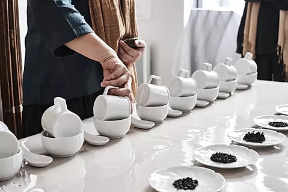

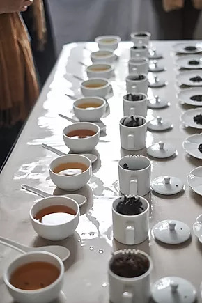

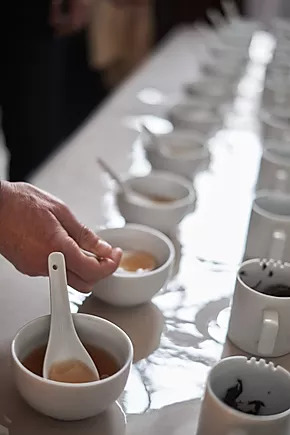

Et voici le moment tant attendu ! Nous sommes tous prêts à faire cet intime voyage avec le thé.

La dégustation des 10 grands thés de Taïwan, 2ème étape : honorer le goût, le corps.

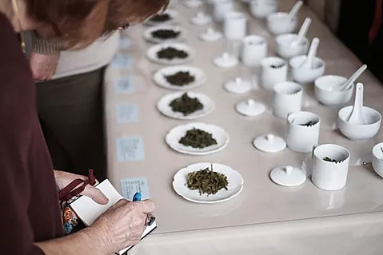

Et même  "nourrir la tête"...

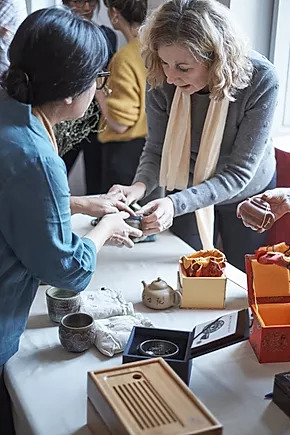

À 16 heures, ont lieu la cérémonie du thé avec "les 18 mouvements" et une petite vente des objets de l'art du thé.

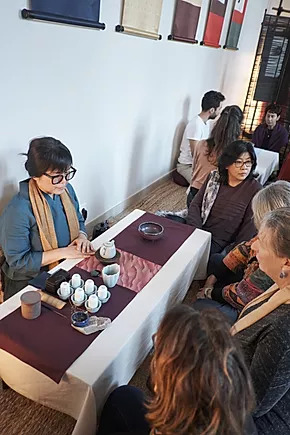

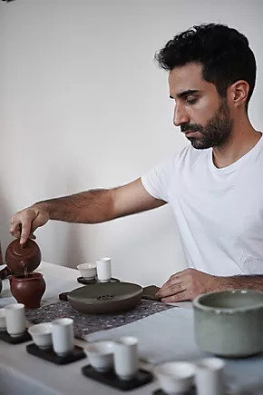

La cérémonie du Gong Fu Cha avec "les 18 mouvements" est présentée par Maxime et moi-même.

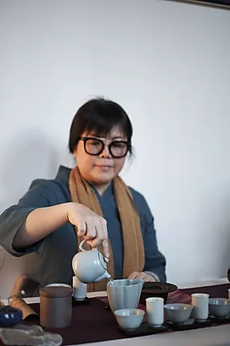

La méthode des "18 mouvements" est proposée et pratiquée dans notre école de thé. Cette méthode est mise en pratique par mon maître du thé  qui m'a donné l'autorisation de l'enseigner.

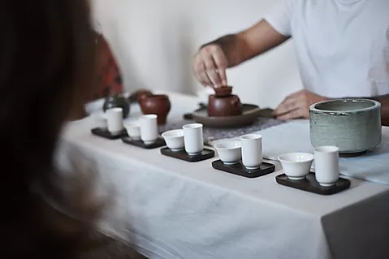

3 ème étape de l'événement : la maîtrise des gestes et le calme mental.

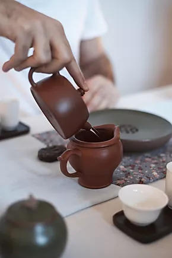

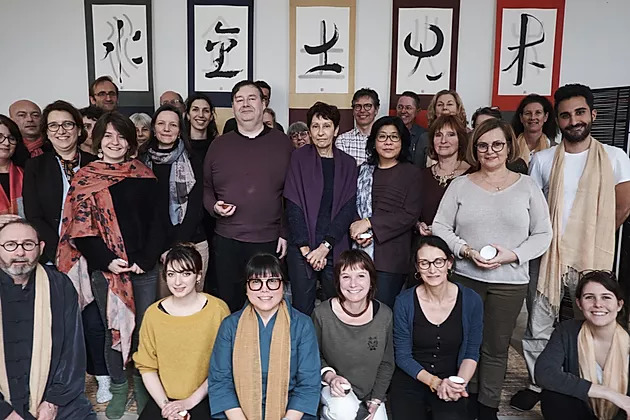

Merci à  tous nos invités !

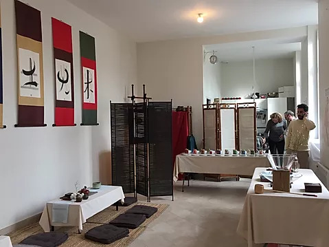

Merci à la Maison de l'Eveil qui, cette année encore, nous a proprosé ce lieu si agréable pour notre grande dégustation.